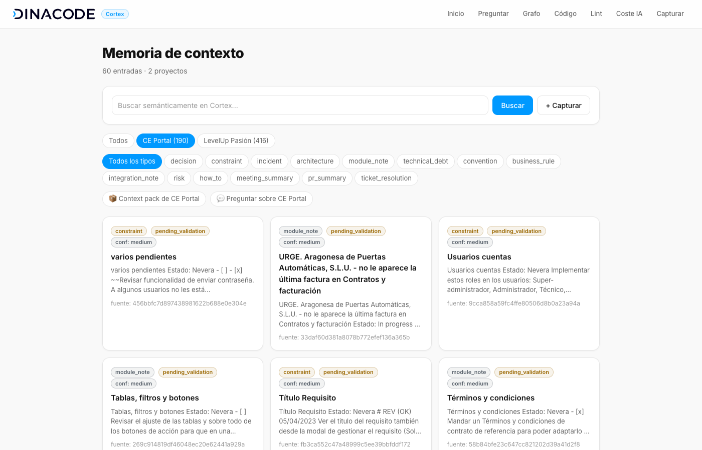
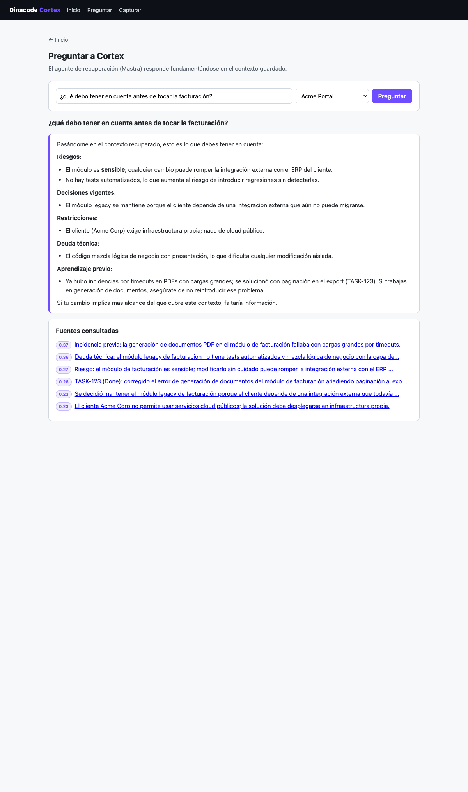
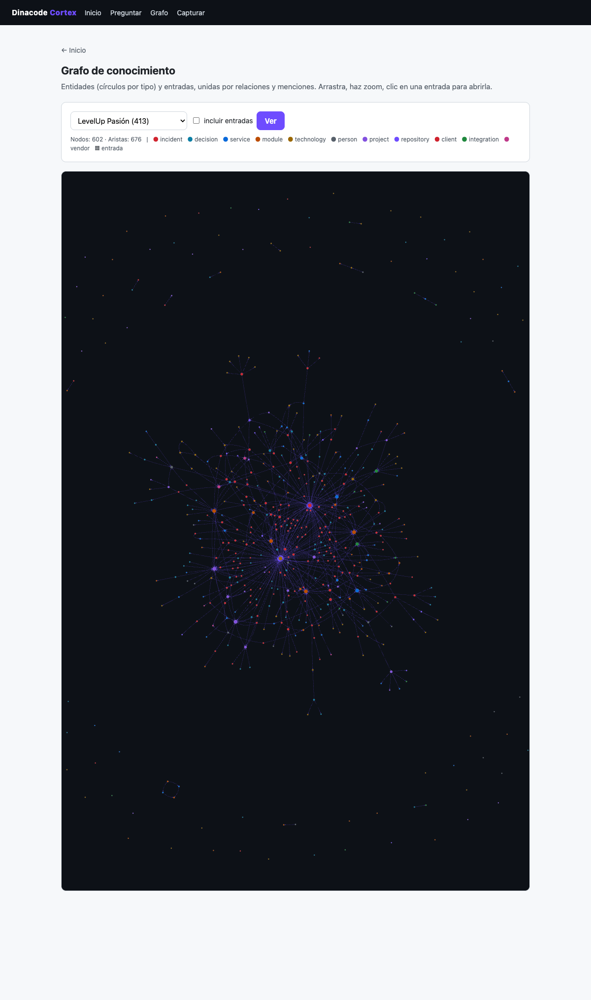
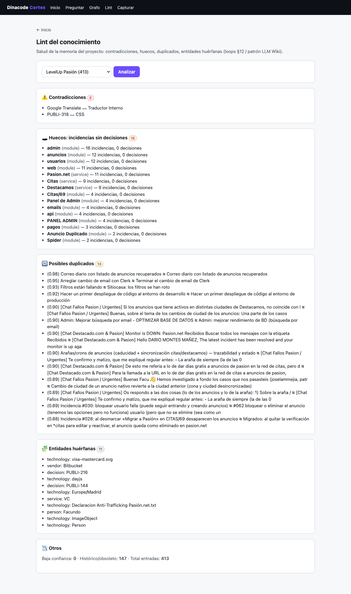
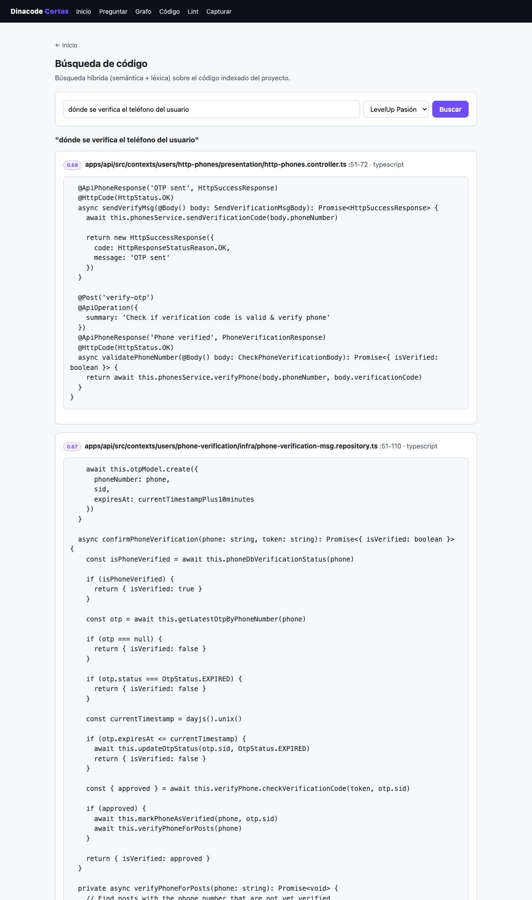
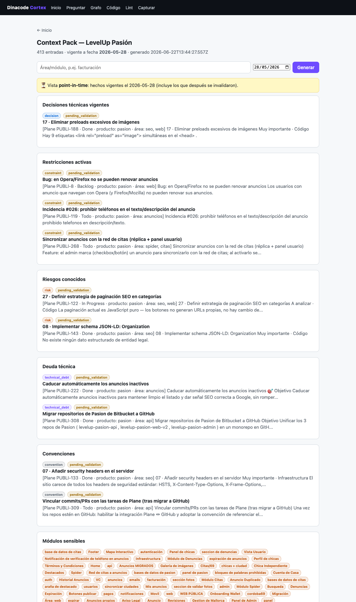

# Dinacode Cortex

**Memoria corporativa de contexto** para proyectos software de una consultora.
Captura conocimiento disperso (decisiones, restricciones, incidencias, convenciones,
PRs, conversaciones, código…), lo estructura en una capa **híbrida — documental +
vectorial + grafo + bi-temporal —** y lo expone a personas y agentes de IA (Claude
Code, Codex, OpenCode) mediante un **MCP corporativo**, para reducir la pérdida de
contexto al cambiar de tarea, módulo, proyecto o persona.

- Plan fundacional: [`dinacode-cortex-contexto-y-plan-demo.md`](./dinacode-cortex-contexto-y-plan-demo.md)
- Decisiones técnicas (ADR): [`docs/decisions.md`](./docs/decisions.md)
- Panorama competitivo y huecos: [`docs/research/competitive-landscape.md`](./docs/research/competitive-landscape.md)
- Guion de demo: [`docs/demo-script.md`](./docs/demo-script.md)

> **Estado: funcional, probado sobre un proyecto real.** PoC ingerido del proyecto
> *LevelUp Pasión*: ~415 entradas (Plane + Google Chat + GitHub) + ~1.700 chunks de
> código, con grafo de ~590 entidades / ~1.100 relaciones y validez temporal.
> Todo funciona sin LLM (cae a heurísticas); con LLM mejora clasificación, grafo y
> respuestas en prosa.








## Capacidades

- **Captura con baja fricción** — clasifica, resume y extrae entidades de cualquier
  texto; detecta duplicados y contradicciones al guardar.
- **Búsqueda híbrida** — vectorial (pgvector) + léxica (FTS de Postgres) fusionadas
  con Reciprocal Rank Fusion, con **rerank LLM** opcional.
- **Grafo de conocimiento** — entidades y relaciones (`affects`, `depends_on`,
  `caused_by`, `supersedes`…) extraídas por LLM, con **resolución de variantes** y
  **visualización** estilo Obsidian.
- **Bi-temporal** — cada hecho tiene ventana de validez; lo obsoleto se **invalida,
  no se borra** → respuestas solo con lo vigente y consultas *point-in-time*.
- **Context packs y Q&A** — paquete de contexto por proyecto/área y respuestas
  sintetizadas con citas (agente de recuperación).
- **Lint del conocimiento** — contradicciones, duplicados, entidades huérfanas y
  **huecos** (áreas con incidencias sin decisiones); con plan de acciones.
- **Indexación de código** — chunking + embeddings de los repos del cliente;
  búsqueda híbrida sobre el código.
- **Multi-fuente** — ingesta desde Plane, Google Chat, GitHub y repos de código,
  unificadas en un mismo grafo.
- **MCP corporativo** — 8 tools neutras consumibles por Claude Code / Codex / OpenCode.
- **Harness distribuible** — `cortex sync` instala el MCP + skills + comandos del
  toolbelt de Dinacode en los agentes del dev.

## Arquitectura

```
Claude Code / Codex / OpenCode
        │  (MCP, 8 tools)
        ▼
  apps/mcp-server  (@cortex/mcp-server)      apps/web  (@cortex/web, Hono SSR)
        │                                          │
        └──────────────┬───────────────────────────┘
                       ▼
        packages/core  (@cortex/core)   ── operaciones de dominio: captura,
                       │   ▲                búsqueda híbrida, context-pack, lint,
                       │   │ setClassifier/  código, bi-temporal, loops de mejora
                       │   │ setReranker
                       │   └── packages/agents (@cortex/agents) ── Agents de Mastra
                       │           (un Agent por rol: classifier, graph, reranker,
                       │           retriever) + workflow de captura
                       ├── packages/embeddings  ── proveedor enchufable
                       │        (local | nan | openai | voyage)
                       └── packages/database     ── Postgres + pgvector + FTS
        packages/shared  (@cortex/shared)  ── modelo de dominio (zod)
```

`@cortex/core` es **determinista** y funciona sin claves. La capa de inteligencia
(`@cortex/agents`, LLM + Mastra) se **inyecta** con `setClassifier()`/`setReranker()`
desde los entrypoints cuando hay LLM. Precedencia en captura: **input explícito >
LLM > heurística**. Ver [`docs/decisions.md`](./docs/decisions.md).

## Puesta en marcha

Requisitos: Node ≥ 20, pnpm, Docker.

```bash
pnpm install
cp .env.example .env          # configura embeddings/LLM (ver abajo)
pnpm db:up                    # Postgres + pgvector (Docker, puerto host 5433)
pnpm db:migrate               # crea el esquema
pnpm web                      # UI en http://localhost:8080
```

**Datos.** Una BD nueva está vacía; opciones:
- Ingerir fuentes reales (ver *Ingesta y conectores*).
- O cargar el proyecto ficticio de demo: `CORTEX_SEED_CONFIRM=1 pnpm db:seed`
  (⚠️ vacía las tablas y recarga "Acme Portal" — por eso pide confirmación).

## Conectar tus agentes (`cortex sync`)

El **toolbelt de Dinacode** (MCP de Cortex + skills/MCPs del ecosistema) se instala
en tus agentes con un comando. Fuente única y **PR-able**: [`config/toolbelt.json`](./config/toolbelt.json).

```bash
pnpm cortex:sync              # dry-run: muestra el plan
pnpm cortex:sync --apply      # instala/actualiza en Claude Code / Codex / OpenCode
pnpm cortex:sync --doctor     # qué auth falta configurar por tool
```

- Reparte **configuración, no credenciales** (cada tool conserva su auth).
- **Preserva** lo ya configurado y **omite** MCPs sin su env.
- Skills por symlink → `git pull` las actualiza. Detalle: [`config/README.md`](./config/README.md).

Toolbelt actual: MCP `cortex`, `plane`, `atlassian` (Jira+Confluence), `notion`,
`chrome-devtools`; skills `cortex-capture`, `plane-api`, `google-chat`, `bkt`,
`agent-teams` (MS Teams), `expect`; comando `/cortex-save`.

## Tools MCP (8)

| Tool | Qué hace |
| --- | --- |
| `save_project_context` | Guarda conocimiento (clasifica, resume, detecta duplicados/contradicciones) |
| `search_project_context` | Búsqueda híbrida (vector + léxico + rerank) |
| `get_project_context_pack` | Paquete de contexto del proyecto/área; admite `asOf` (point-in-time) |
| `list_project_decisions` | Decisiones vigentes |
| `validate_context_entry` | Validar / rechazar / marcar obsoleta |
| `ask_project_context` | Pregunta en lenguaje natural → respuesta sintetizada con fuentes |
| `search_project_code` | Búsqueda híbrida sobre el código indexado |
| `lint_project_context` | Salud del conocimiento (contradicciones, duplicados, huecos…) |

## Ingesta y conectores

```bash
# Ingesta genérica (JSON de items) en 2 fases + embeddings por lotes
pnpm --filter @cortex/core run ingest "<Proyecto>" <items.json>
# GitHub: PRs/issues de un repo (vía gh)
pnpm --filter @cortex/core run connect-github "<Proyecto>" <owner/repo>
# Código: indexa un repo local (excluye generados; chunking + embeddings)
pnpm --filter @cortex/core run index-code "<Proyecto>" <ruta-repo>
```
Plane y Google Chat se ingieren con las skills `plane-api` / `google-chat` + el
`ingest`. Tras ingerir, enriquecer el grafo (capa agents) y resolver entidades.

## Calidad del conocimiento

```bash
pnpm --filter @cortex/core run lint "<Proyecto>"          # informe de salud
pnpm --filter @cortex/core run lint-act "<Proyecto>"      # plan de acciones (dry-run)
pnpm --filter @cortex/core run resolve-entities           # fusiona variantes de entidad
pnpm --filter @cortex/core run temporal                   # invalida hechos no vigentes
```

## Proveedores (embeddings y LLM)

Configurables en `.env`. Por defecto **sin claves** (`local`), con caída a heurísticas.

```bash
# Embeddings: local | nan | openai | voyage
EMBEDDINGS_PROVIDER=nan
# LLM (clasificación, grafo, rerank, síntesis): none | nan | openrouter
LLM_PROVIDER=nan
# nan.builders (OpenAI-compatible, modelos free)
NAN_API_KEY=...
NAN_LLM_MODEL=qwen3.6
NAN_EMBEDDING_MODEL=qwen3-embedding
```

Los embeddings `local` no son semánticos (solo solape léxico): sirven para arrancar
sin claves; para retrieval real usa `nan`/`openai`/`voyage`. Al cambiar de proveedor
de embeddings hay que reindexar (las dimensiones cambian).

## Comandos

| Comando | Qué hace |
| --- | --- |
| `pnpm db:up` / `pnpm db:down` | Levanta / para Postgres |
| `pnpm db:migrate` | Aplica migraciones |
| `pnpm db:seed` | Datos demo Acme (requiere `CORTEX_SEED_CONFIRM=1`) |
| `pnpm web` | UI web (http://localhost:8080) |
| `pnpm mcp` | Servidor MCP (stdio) |
| `pnpm cortex:sync [--apply\|--doctor]` | Instala el toolbelt en tus agentes |
| `pnpm typecheck` | Comprueba tipos en todos los paquetes |
| `pnpm --filter @cortex/core run ingest\|connect-github\|index-code\|lint\|lint-act\|resolve-entities\|temporal …` | Ingesta y mantenimiento (ver arriba) |
| `pnpm --filter @cortex/agents run enrich "<Proyecto>"` | Enriquece el grafo (entidades + relaciones) |
| `pnpm workflow:capture "<texto>" "<Proyecto>"` | Workflow de captura (Mastra) |

## Estructura del repo

```
apps/        mcp-server (MCP stdio) · web (UI Hono SSR)
packages/    core · agents · embeddings · database · shared
config/      toolbelt.json (registry) · mcp · skills/ (vendored) · commands/
scripts/     cortex-sync.ts (instalador del toolbelt)
docs/        decisions.md · demo-script.md · research/ · capturas
```
