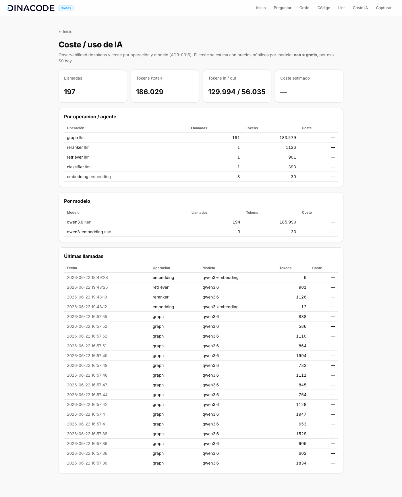

# Dinacode Cortex

**Memoria corporativa de contexto** — **producto de uso interno de Dinacode** para
sus proyectos software. Captura conocimiento disperso (decisiones, restricciones,
incidencias, convenciones, PRs, conversaciones, docs, código…), lo estructura en una
capa **híbrida — documental + vectorial + grafo + bi-temporal —** y lo expone a
personas y agentes de IA (Claude Code, Codex, OpenCode, Hermes) mediante un **MCP
corporativo**, para reducir la pérdida de contexto al cambiar de tarea, módulo,
proyecto o persona.

- Plan fundacional: [`dinacode-cortex-contexto-y-plan-demo.md`](./dinacode-cortex-contexto-y-plan-demo.md)
- Decisiones técnicas (ADR): [`docs/decisions.md`](./docs/decisions.md)
- Roadmap (pendientes): [`docs/roadmap.md`](./docs/roadmap.md)
- Panorama competitivo y huecos: [`docs/research/competitive-landscape.md`](./docs/research/competitive-landscape.md)
- Guion de demo: [`docs/demo-script.md`](./docs/demo-script.md)

> **Estado: producto interno funcional, probado sobre proyectos reales.** Probado con
> **CE Portal**: export de Notion (páginas + adjuntos **multimodales**: docs, imágenes,
> diagramas y vídeo) + repos `ceportal-app` (Angular) y `ceportal-backend` (Java) →
> grafo de cientos de entidades y relaciones. Todo funciona sin LLM (cae a heurísticas);
> con LLM (Agents de Mastra) mejora clasificación, grafo, reconciliación y respuestas en
> prosa. _(Las capturas son anteriores a la ingesta multimodal.)_




## Capacidades

- **Captura con baja fricción** — clasifica, resume y extrae entidades de cualquier
  texto; detecta duplicados y contradicciones al guardar.
- **Búsqueda híbrida** — vectorial (pgvector) + léxica (FTS de Postgres) fusionadas
  con Reciprocal Rank Fusion, con **rerank LLM** opcional.
- **Grafo de conocimiento** — entidades y relaciones (`affects`, `depends_on`,
  `caused_by`, `supersedes`…) extraídas por LLM, con **resolución de variantes** y
  **visualización** estilo Obsidian.
- **Bi-temporal** — cada hecho tiene ventana de validez; lo obsoleto se **invalida,
  no se borra** → respuestas solo con lo vigente y consultas *point-in-time*.
- **Context packs y Q&A** — paquete de contexto por proyecto/área y respuestas
  sintetizadas con citas (agente de recuperación).
- **Lint del conocimiento** — contradicciones, duplicados, entidades huérfanas y
  **huecos** (áreas con incidencias sin decisiones); con plan de acciones.
- **Indexación de código** — chunking + embeddings de los repos del cliente;
  búsqueda híbrida sobre el código.
- **Multi-fuente** — ingesta desde Plane, Google Chat, GitHub y repos de código,
  unificadas en un mismo grafo.
- **MCP corporativo** — 8 tools neutras consumibles por Claude Code / Codex / OpenCode / Hermes.
- **Observabilidad de IA** — coste/tokens por operación, agente y modelo (LLM +
  embeddings) **+ AI tracing de Mastra** (árbol de spans por llamada), en `/usage`.
- **Bucle automático (hooks)** — al abrir sesión, **inyecta** el context-pack del
  proyecto; al cerrarla, **auto-captura** la sesión destilada. Sin fricción, en los 4 agentes.
- **Captura con reconciliación (estilo mem0)** — al guardar conocimiento auto-capturado:
  **ADD / UPDATE (fusiona) / DELETE (invalida contradicciones) / NOOP (dedup)**, con
  confianza baja; `maintain` auto-cura (promueve lo corroborado, decae lo muerto). Evita
  el "context rot". Ver [`docs/research/memory-capture-policy.md`](./docs/research/memory-capture-policy.md).
- **Ingesta multimodal** — capa `extract` única: Word/PDF/Excel, **diagramas .drawio**,
  **imágenes** (caption por visión), **audio/vídeo** (transcripción whisper + ffmpeg).
- **Proyectos: vínculo, permisos y jerarquía** — un repo se vincula por **slug**
  (`.cortex.json`); proyectos **públicos por defecto** o **privados** (dueño/miembros),
  **admin(s)** por env; **jerarquía padre/cliente** con herencia de contexto y permisos.
- **Servidor HTTP + auth** — API (Hono) con **login email + OTP** (sin passwords, Brevo);
  base de identidad/atribución y permisos.
- **CLI `cortex`** y **harness distribuible** — un solo comando (`cortex link`, `auth`,
  `sync`, `maintain`…); `cortex sync` instala MCP + skills + comandos + **hooks** del
  toolbelt en los agentes del dev. Reparte **configuración, no credenciales**.

## Arquitectura

```
Claude Code / Codex / OpenCode / Hermes
   │ (MCP, 8 tools)   │ (hooks: inyecta contexto / auto-captura)
   ▼                  ▼
 apps/mcp-server   apps/cli (cortex …)   apps/web (Hono SSR)   apps/server (API + auth OTP)
        │               │                     │                      │
        └───────────────┴──────────┬──────────┴──────────────────────┘
                                    ▼
        packages/core  (@cortex/core)   ── operaciones de dominio: captura,
                       │   ▲                búsqueda híbrida, context-pack, lint, código,
                       │   │ setClassifier/  bi-temporal, reconciliación, proyectos/slug/
                       │   │ setReranker/    permisos/jerarquía, auth (OTP), extract multimodal
                       │   │ setReconciler
                       │   └── packages/agents (@cortex/agents) ── Agents de Mastra (un Agent
                       │           por rol: classifier, graph, reranker, retriever, distiller,
                       │           merger, reconciler) + maintain + hooks de captura
                       ├── packages/embeddings  ── proveedor enchufable (local|nan|openai|voyage)
                       └── packages/database     ── Postgres + pgvector + FTS + migraciones
        packages/shared  (@cortex/shared)  ── modelo de dominio (zod)
```

`@cortex/core` es **determinista** y funciona sin claves. La capa de inteligencia
(`@cortex/agents`, LLM + Mastra) se **inyecta** con `setClassifier()`/`setReranker()`/
`setReconciler()` desde los entrypoints cuando hay LLM. Precedencia en captura: **input
explícito > LLM > heurística**. Ver [`docs/decisions.md`](./docs/decisions.md) y, para
contribuir, [`CONTRIBUTING.md`](./CONTRIBUTING.md).

## Puesta en marcha

Requisitos: Node ≥ 20, pnpm, Docker.

```bash
pnpm install
cp .env.example .env          # configura embeddings/LLM (ver abajo)
pnpm db:up                    # Postgres + pgvector (Docker, puerto host 5433)
pnpm db:migrate               # crea el esquema
pnpm web                      # UI en http://localhost:8080
```

**Datos.** Una BD nueva está vacía; opciones:
- Ingerir fuentes reales (ver *Ingesta y conectores*).
- O cargar el proyecto ficticio de demo: `CORTEX_SEED_CONFIRM=1 pnpm db:seed`
  (⚠️ vacía las tablas y recarga "Acme Portal" — por eso pide confirmación).

## Conectar tus agentes (`cortex sync`)

El **toolbelt de Dinacode** (MCP de Cortex + skills/MCPs del ecosistema) se instala
en tus agentes con un comando. Fuente única y **PR-able**: [`config/toolbelt.json`](./config/toolbelt.json).

```bash
pnpm cortex:sync              # dry-run: muestra el plan
pnpm cortex:sync --apply      # instala/actualiza en Claude Code / Codex / OpenCode / Hermes
pnpm cortex:sync --doctor     # qué auth falta configurar por tool
```

- Reparte **configuración, no credenciales** (cada tool conserva su auth).
- **Preserva** lo ya configurado y **omite** MCPs sin su env.
- Skills por symlink → `git pull` las actualiza. Detalle: [`config/README.md`](./config/README.md).

Toolbelt actual: MCP `cortex`, `plane`, `atlassian` (Jira+Confluence), `notion`,
`chrome-devtools`; skills `cortex-capture`, `plane-api`, `google-chat`, `bkt`,
`agent-teams` (MS Teams), `expect`; comando `/cortex-save`.

`cortex sync --apply` también instala los **hooks** y un **CLI `cortex`** global (shim en
`~/.local/bin`, mac+Linux). Tras el bootstrap (`pnpm install` → `pnpm cortex:sync --apply`):

```bash
cortex auth login                       # login email + OTP (una vez por equipo)
cortex link --create "Mi Proyecto"      # crea el proyecto y vincula esta carpeta
cortex maintain "Mi Proyecto"           # mantenimiento; cortex <cmd> --help para ver todo
```

## Vincular un proyecto (`cortex link`)

Cortex es **opt-in por repo**: solo actúa donde hay un **`.cortex.json`** (`{ "slug": "…" }`).
Sin él, ni se inyecta ni se captura nada (un repo personal queda fuera). El slug lo asigna
Cortex al crear el proyecto (clave estable, **independiente de git** → vale para monorepos,
carpetas con varios git, o repos no clonados). **Vincular ≠ crear**: un slug inexistente se
rechaza (no se auto-crea).

```bash
cortex link --create "Boluda API" --parent boluda --private  # crear (privado, bajo "boluda")
cortex link <slug>        # vincular a un proyecto existente
cortex link --ignore      # opt-out: este repo NO usa Cortex (corta la herencia si está anidado)
```

**Permisos.** Proyectos **públicos por defecto** (cualquier usuario autenticado) o
**privados** (dueño + miembros + admin). **Admin(s)** por env (`CORTEX_ADMIN_EMAIL`,
coma-separado) ven todo y gestionan permisos. **Jerarquía**: un proyecto puede colgar de un
**padre** (cliente "Boluda"): el context-pack del subproyecto **hereda** el del padre y los
permisos **cascadean** (padre privado → subproyectos restringidos; miembro del padre → acceso).

## Servidor y autenticación (email + OTP)

`apps/server` (Hono) expone la API y el login **sin passwords**: el usuario **es su correo**
(whitelist de dominios, `CORTEX_AUTH_DOMAIN`); el OTP solo se usa para **autenticar la CLI**
una vez por equipo. Es la base de **atribución** (`created_by` = email) y permisos.

```bash
cortex server             # arranca la API (CORTEX_SERVER_PORT, def 8787)
cortex auth login|status|logout
cortex ui                 # abre la UI web YA autenticada (sin OTP; usa el token de la CLI)
```

La **UI web** requiere sesión: `cortex ui` hace el handshake (`/auth/cli?token=…`) y deja
una **cookie httpOnly**. Cada quien ve solo los proyectos a los que tiene acceso (admin ve
todos); los privados ajenos quedan ocultos y bloqueados también por URL directa.

Envío de OTP por **Brevo** (`BREVO_API_KEY`); **sin clave, modo dev**: el código se loguea
(no envía email). Tokens y OTP se guardan **hasheados**.

## Bucle automático (hooks)

Instalados por `cortex sync`, cierran el bucle "trabajas → Cortex recuerda/aprende":

- **SessionStart** → inyecta el **context-pack** del proyecto vinculado (los 4 agentes;
  Codex/OpenCode/Hermes vía sus adaptadores).
- **SessionEnd** (Claude) → **auto-captura**: destila la sesión y la guarda con
  reconciliación (ADD/UPDATE/DELETE/NOOP) y confianza baja.

Análisis y fricción por plataforma: [`docs/research/hooks-integration.md`](./docs/research/hooks-integration.md).

## Tools MCP (8)

| Tool | Qué hace |
| --- | --- |
| `save_project_context` | Guarda conocimiento (clasifica, resume, detecta duplicados/contradicciones) |
| `search_project_context` | Búsqueda híbrida (vector + léxico + rerank) |
| `get_project_context_pack` | Paquete de contexto del proyecto/área; admite `asOf` (point-in-time) |
| `list_project_decisions` | Decisiones vigentes |
| `validate_context_entry` | Validar / rechazar / marcar obsoleta |
| `ask_project_context` | Pregunta en lenguaje natural → respuesta sintetizada con fuentes |
| `search_project_code` | Búsqueda híbrida sobre el código indexado |
| `lint_project_context` | Salud del conocimiento (contradicciones, duplicados, huecos…) |

## Ingesta y conectores

```bash
# Ingesta genérica (JSON de items) en 2 fases + embeddings por lotes
pnpm --filter @cortex/core run ingest "<Proyecto>" <items.json>
# GitHub: PRs/issues de un repo (vía gh)
pnpm --filter @cortex/core run connect-github "<Proyecto>" <owner/repo>
# Documentos/multimodal: carpeta suelta → texto indexable (Word/PDF/Excel/.drawio,
# imágenes con caption por visión, audio/vídeo transcritos). Requiere ffmpeg para A/V.
pnpm --filter @cortex/core run connect-docs "<Proyecto>" <ruta-dir>
# Notion: export (Markdown + adjuntos) → páginas + adjuntos parseados y enlazados
pnpm --filter @cortex/core run connect-notion-export "<Proyecto>" <ruta-export>
# Código: indexa un repo local (excluye generados; chunking + embeddings)
pnpm --filter @cortex/core run index-code "<Proyecto>" <ruta-repo>
# Sesiones de agente: destila las conversaciones (Claude Code) de un proyecto a
# conocimiento tipado (depurado, sin secretos). v1: Claude.
pnpm --filter @cortex/agents run connect-sessions "<Proyecto>" <ruta-repo> [claude]
```
Plane y Google Chat se ingieren con las skills `plane-api` / `google-chat` + el
`ingest`. Tras ingerir, enriquecer el grafo (capa agents) y resolver entidades.

## Calidad del conocimiento

```bash
pnpm --filter @cortex/core run lint "<Proyecto>"          # informe de salud
pnpm --filter @cortex/core run lint-act "<Proyecto>"      # plan de acciones (dry-run)
pnpm --filter @cortex/core run resolve-entities           # fusiona variantes de entidad
pnpm --filter @cortex/core run temporal                   # invalida hechos no vigentes
```

### Mantenimiento periódico (server)

Pipeline único que encadena enrich(only-missing) → resolve-entities → temporal →
lint, idempotente y con lock (no solapa). Pensado para el server (el **sync de
fuentes es manual**, lo dispara el developer; esto es solo mantenimiento):

```bash
pnpm --filter @cortex/agents run maintain ["<Proyecto>"]   # una pasada (todos si se omite)
pnpm --filter @cortex/agents run maintain:worker           # worker programado (CORTEX_MAINTAIN_CRON, def "0 3 * * *")
```

## Proveedores (embeddings y LLM)

Configurables en `.env`. Por defecto **sin claves** (`local`), con caída a heurísticas.

```bash
# Embeddings: local | nan | openai | voyage
EMBEDDINGS_PROVIDER=nan
# LLM (clasificación, grafo, rerank, síntesis): none | nan | openrouter
LLM_PROVIDER=nan
# nan.builders (OpenAI-compatible, modelos free)
NAN_API_KEY=...
NAN_LLM_MODEL=qwen3.6
NAN_EMBEDDING_MODEL=qwen3-embedding
```

Los embeddings `local` no son semánticos (solo solape léxico): sirven para arrancar
sin claves; para retrieval real usa `nan`/`openai`/`voyage`. Al cambiar de proveedor
de embeddings hay que reindexar (las dimensiones cambian).

## Comandos

| Comando | Qué hace |
| --- | --- |
| `pnpm db:up` / `pnpm db:down` | Levanta / para Postgres |
| `pnpm db:migrate` | Aplica migraciones |
| `pnpm db:seed` | Datos demo Acme (requiere `CORTEX_SEED_CONFIRM=1`) |
| `pnpm web` | UI web (http://localhost:8080) |
| `pnpm mcp` | Servidor MCP (stdio) |
| `cortex` (o `pnpm cortex <cmd>`) | CLI unificado: `auth`, `server`, `link`, `sync`, `maintain`, `connect-*` |
| `cortex auth login\|status\|logout` | Login email + OTP contra el servidor |
| `cortex ui` | Abre la UI web ya autenticada (handshake con el token de la CLI) |
| `cortex server` (`pnpm --filter @cortex/server start`) | API HTTP + auth (puerto 8787) |
| `cortex link [--create "<N>"] [--parent <slug>] [--private\|--ignore]` | Vincular/crear el proyecto de esta carpeta |
| `pnpm cortex:sync [--apply\|--doctor]` | Instala el toolbelt (MCP + skills + comandos + hooks + CLI) en tus agentes |
| `pnpm typecheck` | Comprueba tipos en todos los paquetes |
| `pnpm --filter @cortex/core run ingest\|connect-github\|index-code\|lint\|lint-act\|resolve-entities\|temporal …` | Ingesta y mantenimiento (ver arriba) |
| `pnpm --filter @cortex/agents run enrich "<Proyecto>"` | Enriquece el grafo (entidades + relaciones) |
| `pnpm workflow:capture "<texto>" "<Proyecto>"` | Workflow de captura (Mastra) |

## Estructura del repo

```
apps/        mcp-server (MCP stdio) · web (UI Hono SSR) · server (API + auth) · cli (cortex)
packages/    core · agents · embeddings · database · shared
config/      toolbelt.json (registry) · mcp · skills/ (vendored) · commands/
scripts/     cortex-sync.ts (instalador del toolbelt + hooks + CLI)
docs/        decisions.md · roadmap.md · demo-script.md · research/ · capturas
```

Cómo contribuir (PRs), dónde vive cada cosa y convenciones: [`CONTRIBUTING.md`](./CONTRIBUTING.md).
