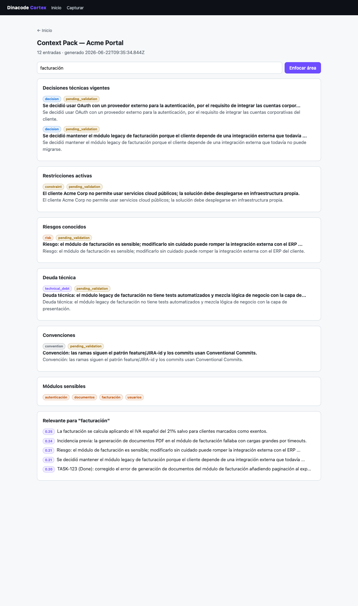

# Dinacode Cortex

Plataforma de **memoria corporativa de contexto** para proyectos software de una
consultora. Captura conocimiento (decisiones, restricciones, incidencias,
convenciones…), lo estructura en una capa híbrida (documental + vectorial +
relacional) y lo expone a personas y agentes de IA mediante un **MCP corporativo**.

Documento fundacional y plan: [`dinacode-cortex-contexto-y-plan-demo.md`](./dinacode-cortex-contexto-y-plan-demo.md).
Decisiones técnicas (hipótesis a validar): [`docs/decisions.md`](./docs/decisions.md).

> Estado: **demo funcional**. Cubre captura, almacenamiento híbrido, búsqueda
> semántica, context packs, loops de mejora (duplicados/contradicciones), servidor
> MCP, UI web y una **capa de agentes (Mastra + LLM vía OpenRouter)** que enriquece
> la captura y sintetiza respuestas de retrieval. Todo funciona sin LLM (cae a
> heurísticas); con LLM mejora la clasificación y habilita respuestas en prosa.




## Arquitectura (demo)

```
Claude Code / Codex / ChatGPT
        │  (MCP)
        ▼
  @cortex/mcp-server   apps/mcp-server  ─┐   — 6 tools corporativas
  @cortex/web          apps/web         ─┤   — UI web de demo (Hono, SSR)
        │                                │
        ▼                                ▼
  @cortex/core               packages/core     — operaciones de dominio
        │   ▲                                     (clasificar, entidades,
        │   │ setClassifier()                      embeddings, loops de mejora)
        │   └── @cortex/agents packages/agents  — capa LLM: Mastra (síntesis) +
        │                                          clasificación (OpenRouter/DeepSeek)
        ├── @cortex/embeddings packages/embeddings — proveedor enchufable
        │                                            (local | openai | voyage)
        └── @cortex/database   packages/database   — Postgres + pgvector
  @cortex/shared             packages/shared   — modelo de dominio (zod)
```

`@cortex/core` es **determinista** y funciona sin claves. La capa de inteligencia
(`@cortex/agents`, Mastra + LLM) se inyecta opcionalmente con `setClassifier()`
desde los entrypoints cuando hay LLM. Precedencia: input explícito > LLM > heurística.

## Puesta en marcha

Requisitos: Node ≥ 20, pnpm, Docker.

```bash
pnpm install
cp .env.example .env      # por defecto: embeddings locales, sin claves
pnpm db:up                # Postgres + pgvector (Docker, puerto host 5433)
pnpm db:migrate           # crea el esquema
pnpm db:seed              # datos de demo: proyecto Acme Portal
```

Lanza la UI de demo:

```bash
pnpm web                  # http://localhost:8080
```

Para conectar Claude Code al MCP, ver [`config/claude-code/README.md`](./config/claude-code/README.md).
Para recorrer la demo, ver [`docs/demo-script.md`](./docs/demo-script.md).

## Embeddings y calidad de búsqueda

Por defecto se usan embeddings **locales deterministas** (sin API keys) para que
todo arranque sin configurar nada. **No son semánticos**: capturan solape léxico,
suficiente para demostrar el cableado. Para relevancia real:

```bash
# en .env
EMBEDDINGS_PROVIDER=openai   # o voyage
OPENAI_API_KEY=...
```

Tras cambiar de proveedor, re-siembra (`pnpm db:seed`) para regenerar embeddings.

## Capa LLM (opcional)

Sin LLM, la captura usa heurísticas locales. Para activar la capa de agentes
(clasificación enriquecida + respuestas sintetizadas vía la tool MCP
`ask_project_context`):

```bash
# en .env
LLM_PROVIDER=openrouter
OPENROUTER_API_KEY=sk-or-...
OPENROUTER_MODEL=deepseek/deepseek-v4-pro
```

Workflow de captura orquestado con Mastra (clasificar → persistir, pasos observables):

```bash
pnpm workflow:capture "Migramos a generación asíncrona con colas" "Acme Portal"
```

## Comandos

| Comando | Qué hace |
| --- | --- |
| `pnpm db:up` / `pnpm db:down` | Levanta / para Postgres |
| `pnpm db:migrate` | Aplica migraciones |
| `pnpm db:seed` | Carga datos de demo (idempotente) |
| `pnpm --filter @cortex/core run ingest "<Proyecto>" <items.json>` | Ingesta masiva (2 fases + embeddings por lotes) |
| `pnpm --filter @cortex/core run lint "<Proyecto>"` | Lint del conocimiento (contradicciones, huecos, duplicados…) |
| `pnpm --filter @cortex/core run index-code "<Proyecto>" <ruta-repo>` | Indexa el código de un repo local (chunks + embeddings) |
| `pnpm --filter @cortex/core run temporal` | Invalidación bi-temporal (cierra ventana de hechos no vigentes) |
| `pnpm mcp` | Arranca el servidor MCP (stdio) |
| `pnpm web` | Arranca la UI web de demo |
| `pnpm typecheck` | Comprueba tipos en todos los paquetes |
